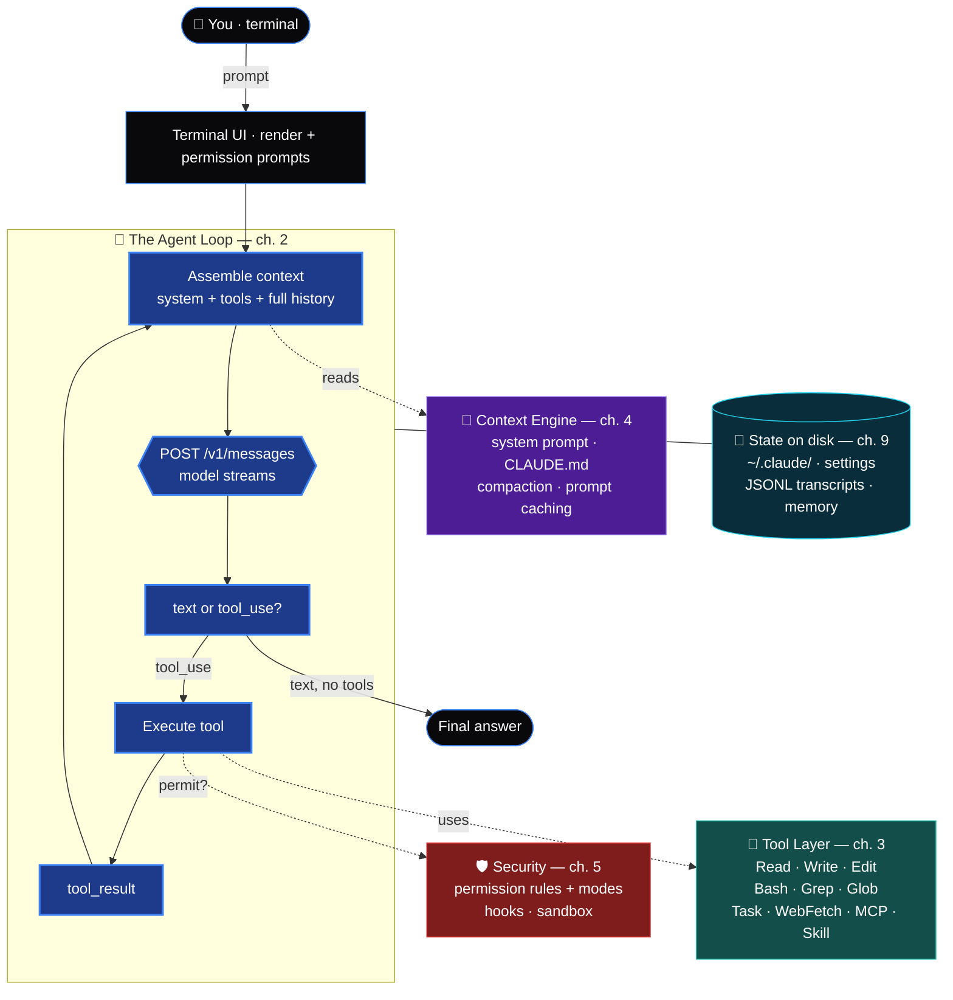

<h1 align="center">🔍 Reverse Engineering Claude Code</h1>

<p align="center">
  <b>How Claude Code actually works — the agent loop, tools, prompts, permissions, memory, and context engine — explained from the inside out, so you can understand it, extend it, or build your own.</b>
</p>

<p align="center">
  <a href="#-the-guide">Guide</a> ·
  <a href="#-the-cli-tool">CLI Tool</a> ·
  <a href="#-how-it-fits-together">Architecture</a> ·
  <a href="#-observe-it-yourself">Observe it yourself</a> ·
  <a href="#-credits">Credits</a>
</p>

<p align="center">
  
  
  
</p>

---

Official docs tell you *what* Claude Code does. This project explains *how* — the machinery under the hood — for developers, researchers, and anyone building AI coding agents. It ships with **11 chapters** of original analysis **and a working CLI** (`recc`) that lets you inspect tokens, cost, and traffic on your own machine.

## 💡 Why this exists

Claude Code ships as an obfuscated bundle, but its behavior, its open-source foundation (the [Claude Agent SDK](https://github.com/anthropics/claude-agent-sdk-typescript)), and its API traffic are all **observable on your own machine**. By studying these — legally, on software you run — we can reconstruct a complete picture of how a production-grade coding agent is engineered. The agent-loop pattern is becoming the foundation of modern dev tooling, and people deserve a clear, honest map of it.

## 🧭 How it fits together



> **Observe the whole thing yourself:** proxy the API (ch. 8) + read `~/.claude/` (ch. 9).

## ⚔️ recc-agent vs. Claude Code

`recc-agent` (this repo's clone) shares Claude Code's real skeleton; the rest of Claude Code
is polish layered on the same core. Each gap maps to a chapter you can read, then build.


## 📖 The Guide

| # | Chapter | What you'll learn |
|---|---------|-------------------|
| 1 | [The Big Picture](docs/01-architecture.md) | Overall architecture: CLI → agent loop → API → tools |
| 2 | [The Agent Loop](docs/02-agent-loop.md) | The core while-loop that turns an LLM into an agent |
| 3 | [The Tool System](docs/03-tools.md) | Every built-in tool, its schema, and why it's designed that way |
| 4 | [System Prompts & Context](docs/04-prompts-and-context.md) | How the context window is assembled, CLAUDE.md, compaction |
| 5 | [Permissions & Hooks](docs/05-permissions-and-hooks.md) | The security model: permission modes, allowlists, hook lifecycle |
| 6 | [Subagents & Skills](docs/06-subagents-and-skills.md) | Task delegation, skills, slash commands, MCP |
| 7 | [Build Your Own](docs/07-build-your-own.md) | A minimal Claude-Code-style agent in ~200 lines |
| 8 | [On the Wire](docs/08-wire-format.md) | Exactly what Claude Code sends the API — proxy it and read it |
| 9 | [State on Disk](docs/09-state-on-disk.md) | Dissecting `~/.claude/`: settings, JSONL transcripts, memory |
| 10 | [Methodology](docs/10-methodology.md) | How to reverse-engineer *any* AI agent, legally |
| 11 | [Glossary & Reference](docs/11-glossary.md) | Every term, plus a "verify any claim" cheat sheet |

## 🛠 The CLI Tool

`recc` (Reverse-Engineer Claude Code) is a small, dependency-light Python CLI for inspecting the things this guide describes — **on your own account, with your own API key**.

```bash
cd tool && pip install -r requirements.txt
export ANTHROPIC_API_KEY=sk-ant-...        # your own key

recc tokens "some text or a file"    # count tokens locally + via API
recc cost   ~/.claude/projects/*/*.jsonl  # reconstruct what a session cost
recc sessions                        # list & summarize local sessions
recc inspect <session.jsonl>         # pretty-print a transcript (tool calls, usage)
recc proxy                           # run a logging proxy; point ANTHROPIC_BASE_URL at it
```

See [`tool/README.md`](tool/README.md) for details. The tool never bypasses billing or authentication — it *observes* your own usage so you can understand and optimize it.

## 🤖 The Agent — a working Claude Code clone

`recc-agent` is a real, runnable terminal coding agent in a single file — the guide's
chapter 7 mini-agent grown into something usable. It has the agent loop, a full tool layer
(`read_file`/`write_file`/`edit_file`/`bash`/`grep`/`glob`), a permission system with
hard-blocked dangerous commands, streaming output, `CLAUDE.md` context, a live token/cost
meter, and session save/`--resume`.

Install once and get **two real CLI commands** — `recc` (inspector) and `recc-agent` (the clone):

```bash
pip install -e .                            # from the repo root
export ANTHROPIC_API_KEY=sk-ant-...         # your own key

recc-agent "add a --version flag to cli.py" # one-shot
recc-agent                                  # interactive REPL
recc-agent --resume                         # continue last session
recc-agent --model claude-haiku-4-5 --yolo  # cheap + auto-approve

recc tokens ./prompt.md                     # inspector still there
recc cost ~/.claude/projects/*/*.jsonl
```

(No install needed to try it: `python3 agent/recc_agent.py "..."` works from source too.)

See [`agent/README.md`](agent/README.md). It calls the **official API with your own key** —
it is a learning-grade clone of *how Claude Code is built*, not a way to use Claude for free.

## 🔬 Observe it yourself

You don't have to take this guide's word for anything:

- **Read the SDK**: `npm i @anthropic-ai/claude-agent-sdk` — the agent engine is right there.
- **Intercept traffic**: point `ANTHROPIC_BASE_URL` at `recc proxy` (or mitmproxy) to see every request: system prompt, tool schemas, messages. (Chapter 8.)
- **Inspect state on disk**: `~/.claude/` — settings, session transcripts, todos, memory. (Chapter 9.)
- **Verbose mode**: `claude --verbose` / `--debug` expose internal decisions.

## ⚖️ Scope & ethics

This is **research and education**, and it's about *understanding* — not piracy. This project will **not** help you bypass Anthropic's billing, evade authentication, or use Claude without paying; those aren't reverse engineering, they're abuse, and they'd get your account banned. What it *does* teach is how the agent works and how to run your own agent against the official API with your own key (chapter 7). If cost is the concern, the honest levers are: use cheaper models (Haiku) for routine work, lean on prompt caching, prune context, and check Anthropic's free-tier / rate-limit terms — all covered in the guide.

## 🙌 Credits

- [anthropics/claude-agent-sdk-typescript](https://github.com/anthropics/claude-agent-sdk-typescript) — the open-source engine
- [bgauryy/open-docs](https://github.com/bgauryy/open-docs) — excellent independent deep-dive docs on AI CLI internals (research material; linked, not reproduced)
- Official [Claude Code docs](https://code.claude.com/docs)

## 📄 Disclaimer

Educational and research purposes. All content is original analysis based on public source code, public documentation, and observable behavior on the author's own machine. "Claude" and "Claude Code" are trademarks of Anthropic; this is an unofficial, independent project. Licensed [MIT](LICENSE).
