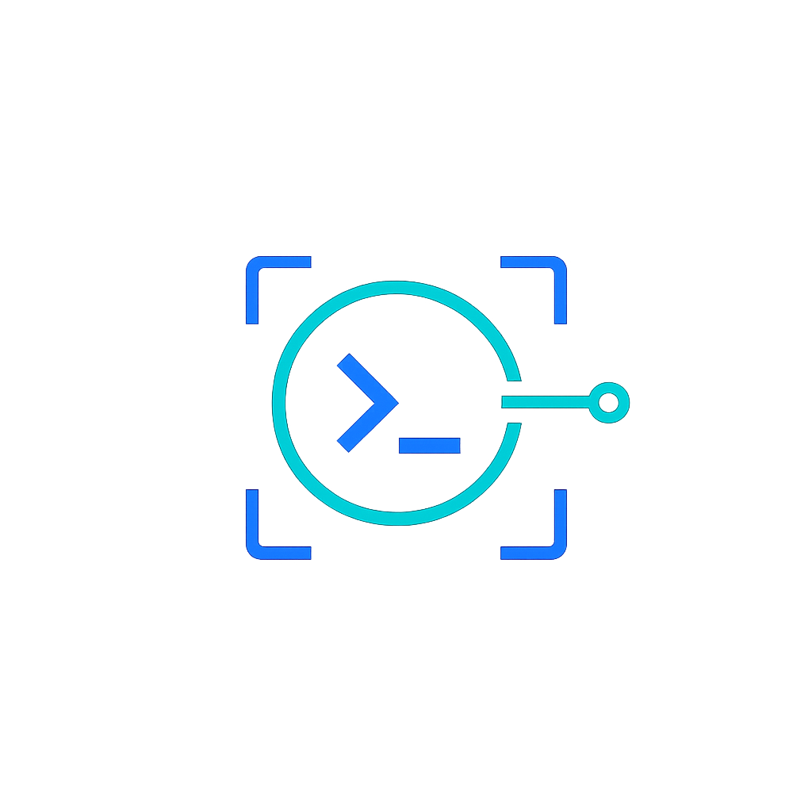
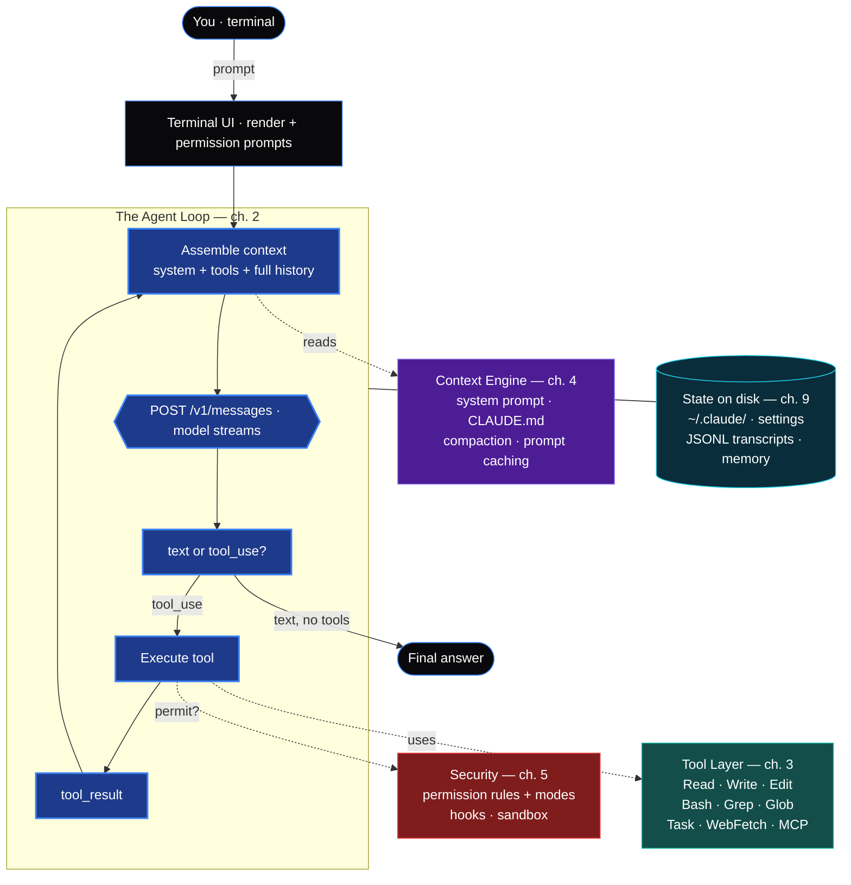

<div align="center">



<a href="https://github.com/SaieshwarTech/reverse-engineering-claude-code">
  
</a>

<p><b>The agent loop, tools, prompts, permissions, memory, and context engine —<br/>explained from the inside out, with a working open-source clone you can run.</b></p>

<p>
  <a href="#the-guide"><b>Guide</b></a> &nbsp;·&nbsp;
  <a href="#the-cli"><b>The CLI</b></a> &nbsp;·&nbsp;
  <a href="#how-it-fits-together"><b>Architecture</b></a> &nbsp;·&nbsp;
  <a href="#observe-it-yourself"><b>Observe it</b></a> &nbsp;·&nbsp;
  <a href="#contributing"><b>Contribute</b></a>
</p>

<p>
  
  
  
  
</p>

<p>
  
  
  
  
</p>

</div>

---

Official docs tell you *what* Claude Code does. This project explains *how* — the machinery under the hood — for developers, researchers, and anyone building AI coding agents. It ships with **11 chapters** of original analysis, an inspector CLI (**`recc`**), and a runnable open-source clone (**`recc-agent`**).

### Why this exists

Claude Code ships as an obfuscated bundle, but its behavior, its open-source foundation (the [Claude Agent SDK](https://github.com/anthropics/claude-agent-sdk-typescript)), and its API traffic are all **observable on your own machine**. By studying these — legally, on software you run — we can reconstruct a complete picture of how a production-grade coding agent is engineered. The agent-loop pattern is becoming the foundation of modern dev tooling, and people deserve a clear, honest map of it.

<h2 id="the-cli">The CLI</h2>

Install straight from GitHub today; the package name **`recc-cli`** is reserved on both
PyPI and npm (verified available 2026-07-03) and publishing is documented in
[`PUBLISHING.md`](PUBLISHING.md) — once it's live, `pip install recc-cli` / `npm i -g recc-cli` resolve directly, no source needed.

```bash
# pip, from source (works today)
pip install "git+https://github.com/SaieshwarTech/reverse-engineering-claude-code"

# pip, once published to PyPI
pip install recc-cli

# npm, once published (wrapper over the PyPI package; needs Python 3.9+ on PATH)
npm install -g recc-cli

export ANTHROPIC_API_KEY=sk-ant-...     # your own key
recc-agent
```

You get five commands: **`recc-agent`** (terminal clone), **`recc`** (inspector), and three
OpenClaw-style chat channels — **`recc-bridge`** (Telegram), **`recc-mail`** (Gmail/IMAP),
**`recc-whatsapp`** (Meta Cloud API). Host them online with the included `Dockerfile` — see
[chapter 13](docs/13-deploy.md).

**What `recc-agent` looks like:**

```text
╭───────────────────────────────────────────────────────────────╮
│  recc-agent   model: claude-sonnet-5   session: 8f2a1c9d       │
│  ───────────────────────────────────────────────────────────  │
│                                                                 │
│  ›  fix the failing test                                        │
│                                                                 │
│     I'll run the tests first to see what's failing.             │
│     ⚙  bash     npm test 2>&1 | tail -30                        │
│     ⧗  in≈18,204   out≈96   cost≈$0.0021                        │
│                                                                 │
│     Off-by-one in sum() — expected 42, got 41. Reading it.      │
│     ⚙  read     src/sum.js                                      │
│     ⚙  edit     src/sum.js   (i < n  ->  i <= n)               │
│                                                                 │
│     ⚠  bash wants to run:  npm test                             │
│        allow?  [y]es  [a]lways  [N]o  ›  a                      │
│     ⚙  bash     npm test                                        │
│                                                                 │
│     ✓  All tests pass. The bug was an off-by-one in sum().      │
│                                                                 │
│  ›  _                                                           │
╰───────────────────────────────────────────────────────────────╯
```

**Talk to it from your phone** — [OpenClaw](https://openclaw.ai/)-style chat channels, all over the same agent loop. Safe by default (read-only); opt into writes explicitly; always lock to yourself. See [chapter 12](docs/12-chat-bridge.md) and [chapter 13](docs/13-deploy.md).

```bash
recc-bridge   --allow-chat <id>                 # Telegram  (TELEGRAM_BOT_TOKEN)
recc-mail     --allow-from you@gmail.com         # Email     (EMAIL_USER/EMAIL_PASS)
recc-whatsapp --allow-from 15551234567           # WhatsApp  (WHATSAPP_TOKEN/PHONE_ID)
# add --allow-writes to let it edit files / run shell (careful!)
```

<table>
<tr><td><b>recc-agent</b> — the clone</td><td><b>recc</b> — the inspector</td></tr>
<tr valign="top"><td>

```bash
recc-agent "add a --version flag"   # one-shot
recc-agent                          # REPL
recc-agent --resume                 # continue
recc-agent --model claude-haiku-4-5 # cheaper
recc-agent --yolo                   # auto-approve
```

</td><td>

```bash
recc tokens ./prompt.md             # count tokens
recc cost ~/.claude/**/*.jsonl      # session cost
recc sessions                       # list sessions
recc inspect <session.jsonl>        # pretty-print
recc proxy                          # log API traffic
```

</td></tr>
</table>

Both call the **official API with your own key**. This is a learning-grade clone of *how Claude Code is built* — not a way to use Claude for free. Details: [`agent/README.md`](agent/README.md) and [`tool/README.md`](tool/README.md).

<h2 id="how-it-fits-together">How it fits together</h2>



> **Observe the whole thing yourself:** proxy the API (ch. 8) + read `~/.claude/` (ch. 9).

### recc-agent vs. Claude Code


<h2 id="the-guide">The guide</h2>

| # | Chapter | What you'll learn |
|---|---------|-------------------|
| 1 | [The Big Picture](docs/01-architecture.md) | Overall architecture: CLI → agent loop → API → tools |
| 2 | [The Agent Loop](docs/02-agent-loop.md) | The core while-loop that turns an LLM into an agent |
| 3 | [The Tool System](docs/03-tools.md) | Every built-in tool, its schema, and why it's designed that way |
| 4 | [System Prompts & Context](docs/04-prompts-and-context.md) | How the context window is assembled, CLAUDE.md, compaction |
| 5 | [Permissions & Hooks](docs/05-permissions-and-hooks.md) | The security model: permission modes, allowlists, hook lifecycle |
| 6 | [Subagents & Skills](docs/06-subagents-and-skills.md) | Task delegation, skills, slash commands, MCP |
| 7 | [Build Your Own](docs/07-build-your-own.md) | A minimal Claude-Code-style agent in ~200 lines |
| 8 | [On the Wire](docs/08-wire-format.md) | Exactly what Claude Code sends the API — proxy it and read it |
| 9 | [State on Disk](docs/09-state-on-disk.md) | Dissecting `~/.claude/`: settings, JSONL transcripts, memory |
| 10 | [Methodology](docs/10-methodology.md) | How to reverse-engineer *any* AI agent, legally |
| 11 | [Glossary & Reference](docs/11-glossary.md) | Every term, plus a "verify any claim" cheat sheet |
| 12 | [The Chat Bridge](docs/12-chat-bridge.md) | OpenClaw-style Telegram/WhatsApp/email assistants over one loop |
| 13 | [Hosting It Online](docs/13-deploy.md) | systemd, Docker, PaaS, tunnels — running the channels 24/7 |

<h2 id="observe-it-yourself">Observe it yourself</h2>

You don't have to take this guide's word for anything:

- **Read the SDK** — `npm i @anthropic-ai/claude-agent-sdk`; the agent engine is right there.
- **Intercept traffic** — point `ANTHROPIC_BASE_URL` at `recc proxy` (or mitmproxy) to see every request. (Ch. 8.)
- **Inspect state on disk** — `~/.claude/`: settings, transcripts, todos, memory. (Ch. 9.)
- **Verbose mode** — `claude --verbose` / `--debug` expose internal decisions.

## Built with

<p>
  
  
  
  
</p>

- **[anthropic](https://pypi.org/project/anthropic/)** — official Python SDK, the only runtime dependency.
- The zero-dependency stdlib powers the inspector and the logging proxy.

<h2 id="contributing">Contributing</h2>

Contributions are welcome — new chapters, agent features (subagents, prompt caching, a richer TUI), corrections, and analyses of *other* agents (Codex CLI, Gemini CLI).

1. Fork and branch: `git checkout -b feature/my-thing`
2. Keep the ethics line: understanding and interop, never billing/auth bypass.
3. Cite sources; don't republish unlicensed content.
4. Open a PR describing what you verified and how.

See [`CONTRIBUTING.md`](CONTRIBUTING.md) for the full guide and good first issues.

### Contributors

Every contributor shows up here automatically:

<a href="https://github.com/SaieshwarTech/reverse-engineering-claude-code/graphs/contributors">
  
</a>

<sub>Be the first — the [good first issues](https://github.com/SaieshwarTech/reverse-engineering-claude-code/issues) are a great place to start.</sub>

## Acknowledgements

- [anthropics/claude-agent-sdk-typescript](https://github.com/anthropics/claude-agent-sdk-typescript) — the open-source engine.
- [bgauryy/open-docs](https://github.com/bgauryy/open-docs) — independent deep-dive docs on AI CLI internals (research material; linked, not reproduced).
- Official [Claude Code docs](https://code.claude.com/docs).

## Scope & ethics

This is **research and education** — about *understanding*, not piracy. It will **not** help you bypass Anthropic's billing, evade authentication, or use Claude without paying; that's abuse, not reverse engineering, and it gets accounts banned. What it teaches is how the agent works and how to run your own against the official API with your own key. If cost is the concern, the honest levers — cheaper models, prompt caching, context pruning, Anthropic's published rate limits — are all covered in the guide.

## License

[MIT](LICENSE). "Claude" and "Claude Code" are trademarks of Anthropic; this is an unofficial, independent project. All content is original analysis based on public sources and behavior observed on the author's own machine.
